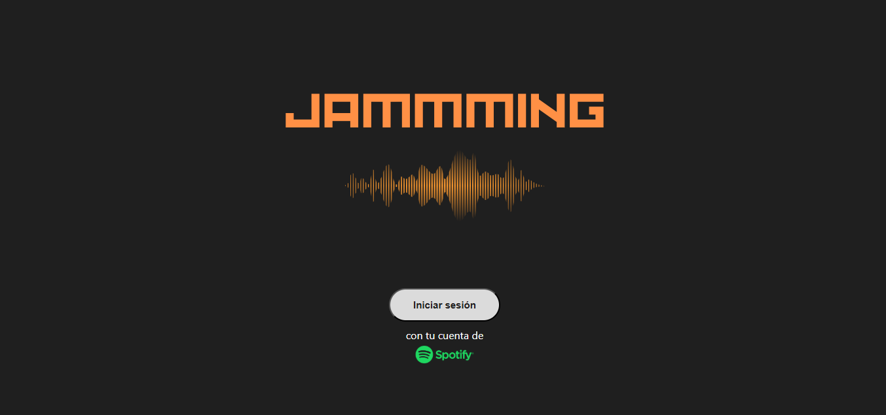
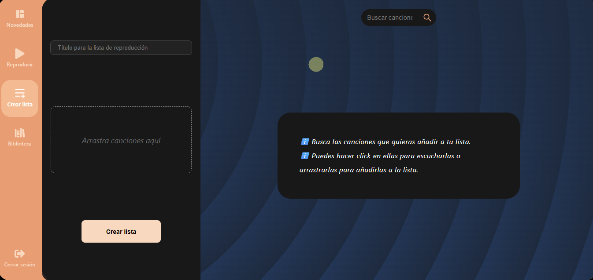
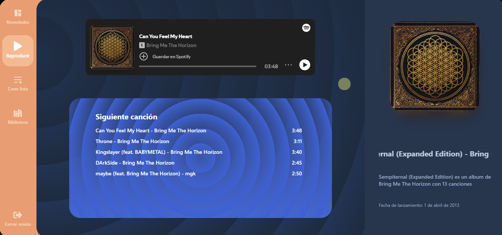

# 🎵 Jammming - Creador de Playlists con Spotify

Jammming es una aplicación web que permite a los usuarios buscar canciones, reproducirlas, organizarlas en listas personalizadas y guardar estas playlists directamente en su cuenta de Spotify. Esta aplicación se creó como parte de una tarea del curso frontend de Codecademy y esta tarea forma el primer proyecto para el portfolio personal.

## 🚀 Características

- 🔍 Búsqueda de canciones en tiempo real usando la API de Spotify.
- ▶️ Reproductor de audio integrado.
- ➕ Añadir y quitar canciones de la playlist de forma interactiva.
- 📝 Asignación automática de nombres como "Mi lista n.º X" si no se especifica uno.
- 🖼️ Portadas generadas automáticamente desde el álbum.
- 💾 Guardado directo de la playlist en tu cuenta de Spotify.
- 💡 Diálogos de confirmación y advertencia personalizados con `SweetAlert2`.
- 🆕 Muestra las últimas novedades, además de poder buscar canciones, con acceso directo a las canciones o álbumes en Spotify.

## 📸 Vista previa

### Pantalla principal

### Funcionalidades

  
  

## 🛠️ Tecnologías utilizadas

- React + Vite
- Spotify Web API
- CSS Modules
- SweetAlert2
- JavaScript
- Html
- LocalStorage

## ⚙️ Herramientas utilizadas en el desarrollo

- Visual Studio Code
- Git & GitHub
- npm / Node.js

## 📚 Recursos de apoyo

- Documentación de Spotify for developers
- ChatGPT
- Sitios con componentes de React como `animate-ui` y `reactbits`
- Sitios web de diseño en CSS de patrones para fondos, degradados,...
- Tutoriales de youtube
- `react-icons`